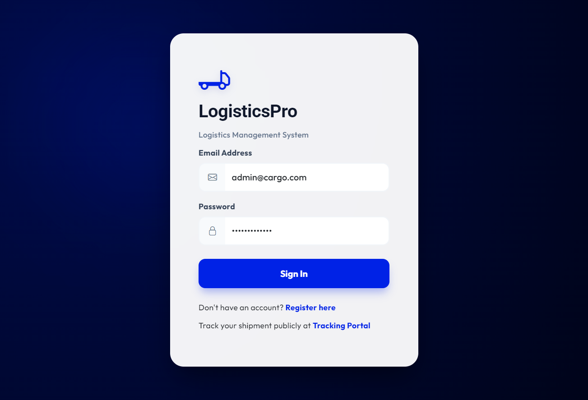
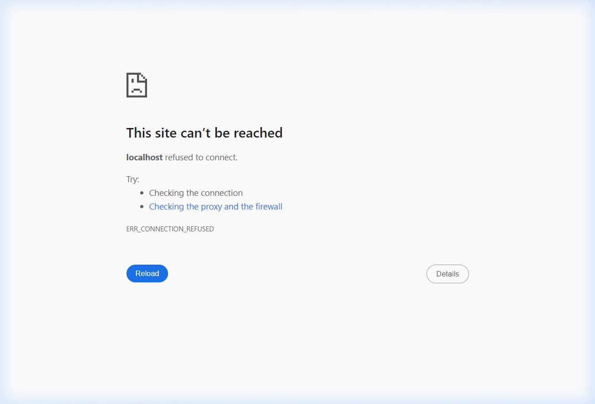

# Logistics Management System

A full-stack, enterprise-grade Logistics Management platform customized for shipment tracking, bookings, and dashboard analytics.

## Application Designs
We feature a premium Glassmorphic User Interface built from the ground up:

<p align="center">
  
  
</p>

## Key Features
- **Booking & Shipments**: Create consignments with intelligent freight and tax calculations.
- **Real-Time Tracking**: Public-facing tracking portal for customers.
- **Analytics Dashboard**: Live Data Visualization (Booking Trends & Status Distribution Arrays).
- **Master Data**: Unified branch, hub, and staff management interface.
- **Single URL Cloud Architecture**: Both the Angular Frontend and backend APIs run seamlessly on a unified Flask Production Server!

## Tech Stack
- **Frontend**: Angular 17, HTML5, Vanilla CSS 
- **Backend**: Python 3, Flask, SQLAlchemy 
- **Database**: SQLite (Configured for easy PostgreSQL drop-in)

## Local Setup
```bash
# 1. Install Backend Dependencies
cd backend
pip install -r requirements.txt

# 2. Run the Unified Server
python app.py

# 3. Access application at
http://localhost:5000
```